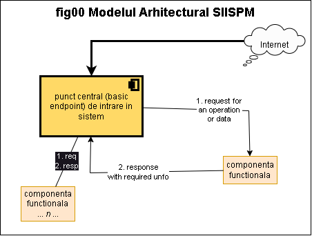

{ width="55" align=left }
<small markdown>**SIISPM System**
</small>  

***Cuprins:***

[TOC]

***

# Sistem Informational Integrat Specializat pentru Protectia Mediului

## Ce este SISPM

Acest sistem este o solutie proiectata si elaborata pentru domeniul de **"Protectie a Mediului"**.

Solutia este bazata pe platforma [*Connections NexGenAI minim versiunea 2.3.3*](http://nexgenai.app/v2.3.3){ target="_blank" } si foloseste cu precadere componentele acesteia.

## Modelul general SII

Modelul general a sistemului este bazat pe o structura arhitecturala orientata pe servicii (Service Oriented Architecture) si adaptata tehnologiilor moderne si actuale (mai bine definite, structurate si performante). In acest sens din modelul istoric-original SOA modelele ce vizeaza datele au fost cu precadre inlocuite cu structuri `JSON` in locul celor `XML` *fara insa a renunta in totalitate la modelele `XML`* pentru a asigura patrarea compatibilitatii (*backward compatibility*).

!!! tip "Avantajele acestui model arhitectural"
    In aceasta structura arhitecturala a sistemului, toate componentele functionale se constituie ca servcii ce:
    
    * ruleaza *independent*
    * nu creaza interferente "blocante" cu celelelte componente
    * pot fi abordate independent ca si implementare dar si functional, cu efectte benefice asupra gradului de *MENTENABILITATE GENERALA A SISTEMULUI*.

In acesta arhietctura exista un punct central (*basic endpoint*) de intrare in sistem. Acesta este deservit de un nod ce comporta orice nivele de scalabilitate si inalta disponibilitate gen: load balancing, clustering, activ-pasiv fail over, etc.

In plus acest nod constituie o premisa suplimentara, simpla, clasica si standardizata de *"izolare"* a componentelor sistemului la nivel TCP (de exemplu serverul de baze de date poate izolat la accesul direct din exterior ai permis a fi accesat numai prin internediul nodului "basic endpoint" care va putea controla astfel accesul si autoorizarile).

Ca si functionnare generala, fara a intra in amanunte. toate componentele functionale se constiuie in servicii ce au diferite capabilitati (pentru exemplificare se va pleca de la o componenta oarecare X, acesteia i se va asocia ruta URL/URI generala **`<SERVER_ROOT>/<componenta_X>/<operatie specifica>`**. Astfel capabilitatile necesare sunt:

* de a raspunde la request pe un path anume, asiguart in exemplu de segmentul de ruta `<componenta_X>`
* de a efectua o comanda specificata prin segmentul de ruta `<operatie specifica>` (asigurind astfel baza pentru un model _JSON RPC_)
* de a intoarce un raspuns in orice format (Content Type) necesar: HTML, JSON, file, binary content, file, etc, practic orice `MIME type` acceptat de standardul HTTP
* de a raspunde la orice metoda standard HTTP relevanta in contextul operatiei cerute: `GET`, `POST`, `PATCH`, `DELETE`, etc

## Aria de acoperire

<small markdown>

!!! warning "Terminologie - componente, module, pachete"
    Prin componente, module, pachete , aplicatii se va intelege la acest nivel simpla componenta logica software, nereperzentind nici un fel de "indicatie" privind modul de impachetare efectiv al elementelor software (cod)

</small>

Solutia acopera urmatoarele domenii de activitate:

### Componente generale

* **(c1)** Portal web servicii electronice ([**referinta aici**](./810.02-System_Landscape.md#c1-portal-web-servicii-electronice)) <!--#NOTE ANPM 5.1.1 -->

* **(c2)** Componenta pentru Managementul documentelor

* **(c3)** Componenta pentru aplicatii specifice GIS

### Componente si module specifice protectiei mediului

* **(c4)** Componenta aplicativ Substante chimice

* **(c5)** Componenta aplicativ pentru Registrul National EMAS

* **(c6)** Componenta aplicativ avize de mediu, acorduri de mediu, autorizatii de mediu si autorizatii integrate de mediu

* **(c7)** Componenta aplicativ Protectia Atmosferei

* **(c8)** Componenta aplicativ Laboratoare

* **(c9)** Componenta aplicativ Monitorizare factori de mediu (radioactivitate)

* **(c10)** Componenta aplicativ pentru Registrul SEVESO

* **(c11)** Componenta aplicativ Emisii Industriale

* **(c12)** Componenta aplicativ EPRTR (date aferente emisiilor si transferurilor de poluanti)

* **(c13)** Componenta aplicativ Sol si subsol

* **(c14)** Componenta aplicativ Ambalaje

* **(c15)** Componenta aplicativ Deseuri cu specializare pe produsele de tip Uleiuri

* **(c16)** Componenta aplicativ Colectare selectiva

* **(c17)** Componenta aplicativ Vehicule scoase din uz

* **(c18)** Componenta aplicativ Transport Deseuri

* **(c19)** Componenta aplicativ Deseuri baterii si acumulatori

* **(c20)** Componenta aplicativ Deseuri echipamente electrice si electronice

* **(c21)** Componenta aplicativ Situri Natura 2000

* **(c22)** Componenta aplicativ privind derogarile si capturile si uciderile accidentale ale speciilor strict protejate

* **(c23)** Componenta aplicativ Autorizarea activitatilor de recoltare/capturare si/sau comercializare a speciilor de flora si fauna salbatice

* **(c24)** Componenta aplicativ URS (alungarile, tranchilizarile  si relocarile ori extragerile prin eutanasiere sau împuscare a exemplarelor de urs)

* **(c25)** Componenta aplicativ Gestiunea incidentelor provocate de speciile de interes cinegetic asupra culturilor agricole, silvice si animalelor domestice

* **(c26)** Componenta aplicativ ZOO

* **(c27)** Componenta aplicativ OMG si MMG (Organisme si Microorganisme modificate genetic)

* **(c28)** Componenta aplicativ Eticheta UE ecologica

* **(c29)** Componenta aplicativ GES (Registrul National al emisiilor de gaze)

* **(c30)** Componenta aplicativ Registrul national al operatorilor economici care nu se supun autorizarii de mediu

* **(c31)** Componenta aplicativ de gestionare a ecosistemelor si a serviciilor acestora în vederea sprijinirii luarii deciziilor de mediu

## Pasii urmatori

!!! danger "Considerente privind stadiul acestui sistem"
    Sistemul prezentat in aceasta documentatie este in stadiul de proiectare astfel:

    * proiectarea de tip _"High Level Design - System Concept"_ este finalizata si reprezentat prin [documentul `810.02-System_Landscape`](./810.02-System_Landscape.md) care *"va face si ghidarea cititorului spre restul dicumentatiei"*
    * proiectarea de lip _"Low Level Design - Detailed Level Design"_ urmeaza a fi realizata

In continuare se recomanda studiul [documentului `120.CPTS_System_Concepts`](./120.CPTS_System_Concepts.md) si a [documentului `810.02-System_Landscape`](./810.02-System_Landscape.md).

