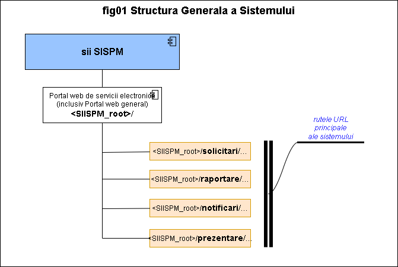

{ width="55" align=left }
<small markdown>**SIISPM System**
</small>  

# Arhitectura sistemului

***Cuprins:***

[TOC]

***

## Introducere

Acest document prezinta arhitectura generala (High Level design) a sistemului:

* o descriere sumara a fiecarei componente (raspunde intrebarii "de ce exista acea componenta?")
* modul general de interconectare intre componente (in principiu si prin exceptie numai pentru situatiile in care acesta NU ESTE EVIDENT si CLASIC / TEORETIC din numele acestuia)

Arhitectura sistemului va fi prezentata intr-o abordare "TOP-DOWN" pentru a oferi o imagine clara si progresiva asupra acestuia.

## Arhitectura logica nivelul TOP

Nivelul de **TOP** reprezinta "punctul cel mai de extern de expunere si adresare a sistemului", cel care va fi folosiit in mod curent de marea majoritate a utilizatorilor. Arhitectura vazuta la acest nivel se prezinta in diagrama urmatoare:

## ... next levels ... <!--#TODO hereuare ->

{ width="100" }

-#TODO UPCOMING...

